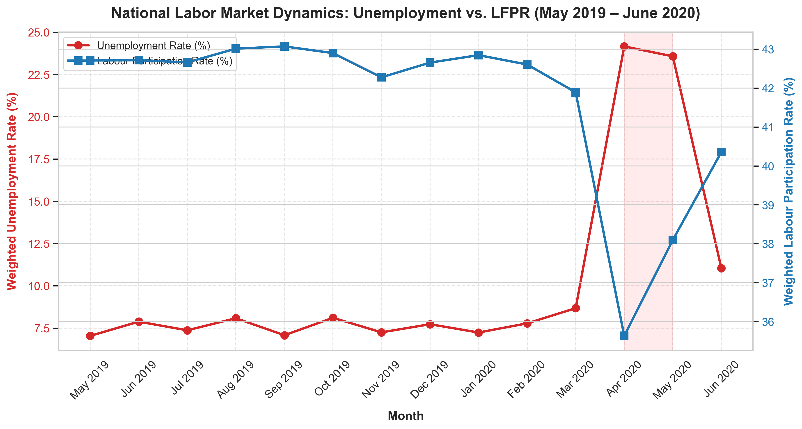
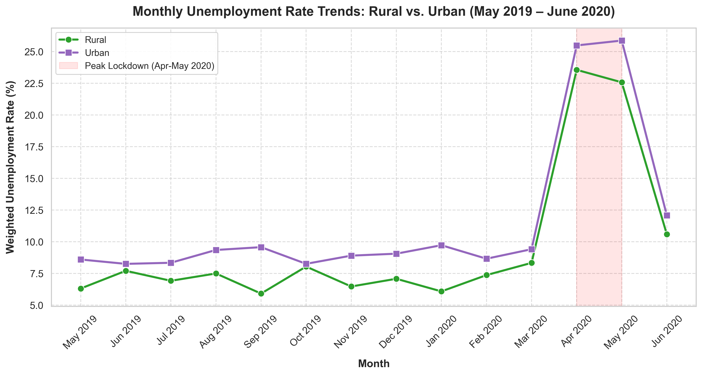
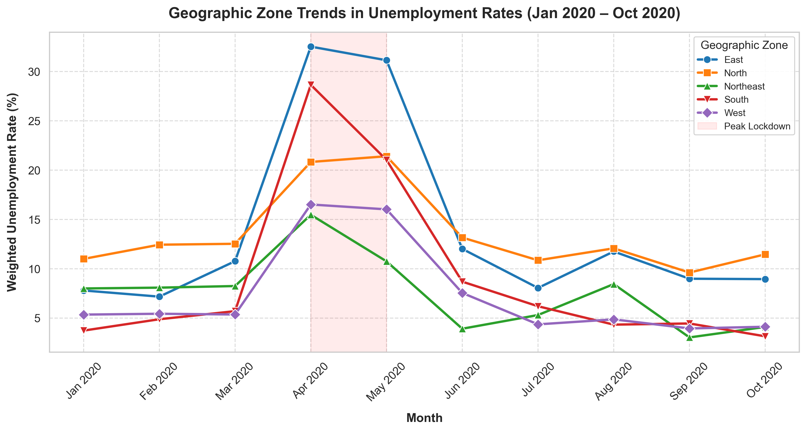
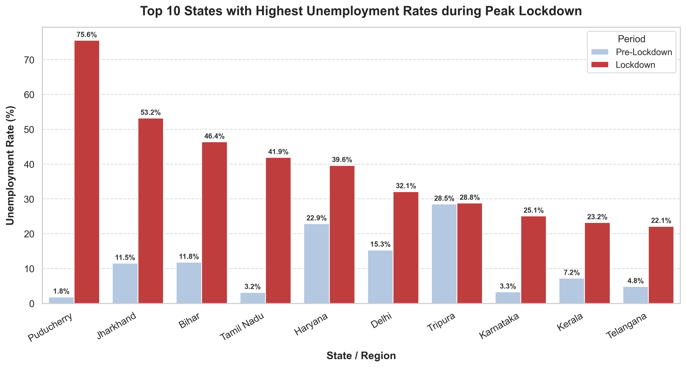
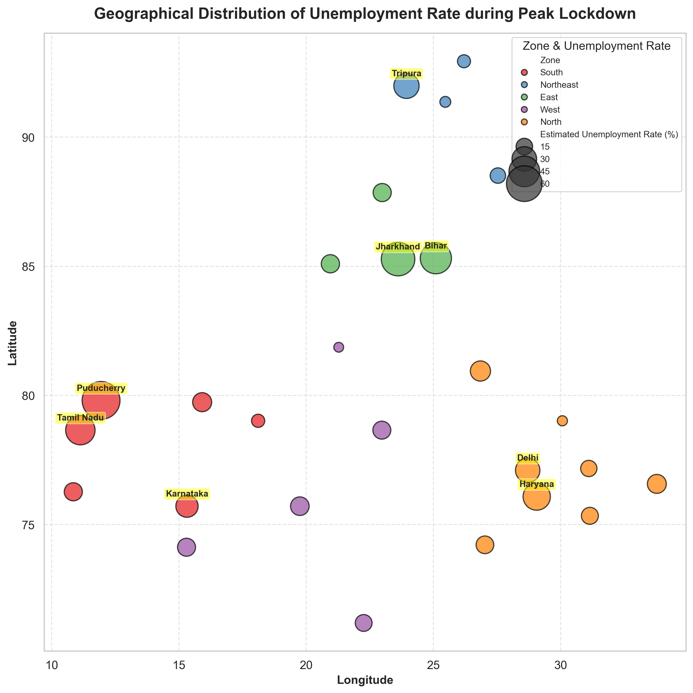

# India Unemployment Rate Analysis (2019-2020)

A professional data science project to clean, explore, visualize, and analyze unemployment data representing the percentage of unemployed people in India. This project investigates the structural shocks of the COVID-19 pandemic and the strict national lockdown (April-May 2020) on employment, labor force participation, and regional dynamics.

---

## 📂 Project Directory Structure

```text
Task2/
├── data/
│   ├── raw/
│   │   ├── Unemployment in India.csv              # Raw survey dataset containing Rural/Urban areas
│   │   └── Unemployment_Rate_upto_11_2020.csv     # Raw dataset containing broader Geographic Zones
│   └── processed/
│       ├── national_period_stats.csv              # National population-weighted period stats
│       ├── rural_urban_period_stats.csv          # Rural vs Urban weighted period stats
│       ├── state_lockdown_impact.csv             # State-by-state lockdown unemployment spikes
│       └── zone_period_stats.csv                  # Zone-wise (North/South/etc.) weighted stats
├── Code/
│   └── unemployment_analysis.py                   # Data cleaning, processing, and plotting script
├── reports/
│   ├── figures/                                   # High-resolution generated visual plots
│   │   ├── plot1_rural_urban_trends.png
│   │   ├── plot2_worst_hit_states.png
│   │   ├── ... (Plots 3-7)
│   └── unemployment_report.md                     # Comprehensive economic analysis and policy report
├── venv/                                          # Virtual environment containing dependencies
└── README.md                                      # Project overview and guide (this file)
```

---

## 🚀 Getting Started

### Prerequisites
- Python 3.10 or higher
- `pip` (Python package manager)

### Installation & Environment Setup
To set up the environment and install dependencies, run the following commands from the project root (`Task2/`):

1. **Create the Virtual Environment**:
   ```bash
   python3 -m venv venv
   ```

2. **Activate the Virtual Environment**:
   - On Linux/macOS:
     ```bash
     source venv/bin/activate
     ```
   - On Windows:
     ```bash
     venv\Scripts\activate
     ```

3. **Install Required Libraries**:
   ```bash
   pip install pandas matplotlib seaborn
   ```

### Running the Analysis
To clean the raw datasets, calculate summary statistics, and regenerate the plots in the directories described above, execute:
```bash
python Code/unemployment_analysis.py
```

---

## 📊 Summary of Core Insights

### Key National Aggregated Metrics (Population-Weighted)
- **Lockdown Spike**: The national weighted unemployment rate jumped from **7.65%** (pre-lockdown) to **23.85%** during the containment restrictions (April-May 2020).
- **Workforce Contraction**: Employment collapsed by **28.7%**, shrinking from a monthly average of **399.3 million** to **284.6 million**—a peak drop of **114.7 million jobs**.
- **Labor Force Dropouts**: The Labor Force Participation Rate (LFPR) fell from **42.67%** to **36.88%**, showing that millions of workers stopped looking for employment during the lockdown.
- **Urban Vulnerability**: Urban markets were hit harder than rural ones. Urban unemployment peaked at **25.68%** and LPR fell by **7.19 percentage points** (driven by the historic reverse migration). Rural unemployment rose to **23.04%** and LPR dropped by **5.05 percentage points**.
- **Regional Disparity**: East India (Bihar, Jharkhand, Odisha, West Bengal) and South India (Tamil Nadu, Puducherry, Kerala, Karnataka, Telangana) suffered the largest shocks, while Northeast India remained the most stable.

---

## 📈 Visual Gallery

### National Labor Market Dynamics: Unemployment vs. LFPR


### Monthly Unemployment Rate Trends: Rural vs. Urban


### Geographic Zone Trends in Unemployment Rates


### Top 10 States with Highest Unemployment Rates during Peak Lockdown


### Geographical Distribution of Unemployment Rate during Peak Lockdown


---

*For detailed policy recommendations and the complete breakdown, please refer to the final report: [reports/unemployment_report.md](reports/unemployment_report.md).*
