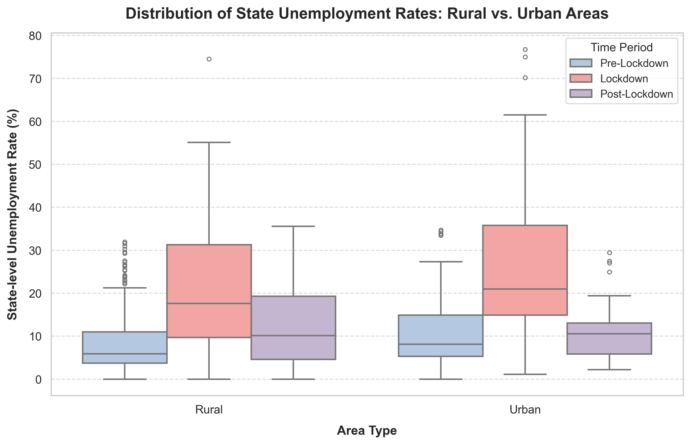
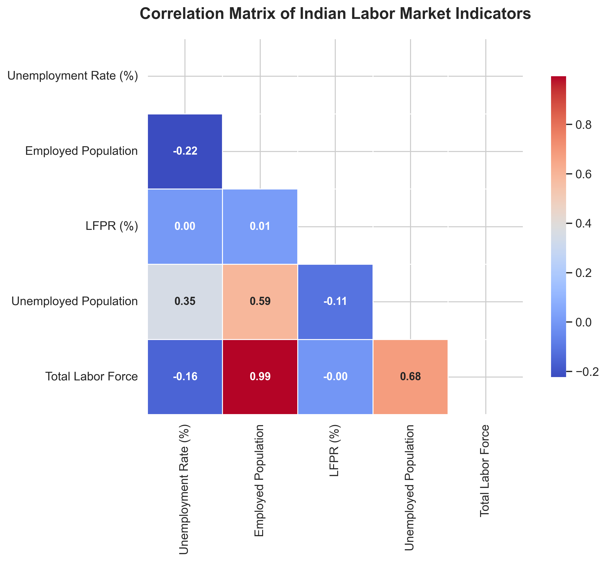

# Comprehensive Analysis of Unemployment Trends in India (2019-2020)
**Focusing on the Socio-Economic Impact of the COVID-19 Pandemic, Rural-Urban Dynamics, and Policy Insights**

---

## Executive Summary
This report presents a Python-based data cleaning, exploration, and visual analysis of the Indian labor market from May 2019 to October 2020. The primary goal is to examine the impact of the COVID-19 pandemic and the subsequent national lockdown (April–May 2020) on employment, unemployment, and labor participation. 

By applying mathematically rigorous, **population-weighted aggregations** rather than simple state averages (which distort figures by treating tiny states like Sikkim identically to massive states like Uttar Pradesh), we reveal the true human and economic scale of the shock:
1. **Unemployment Rate Spike**: The national weighted unemployment rate surged from a pre-lockdown average of **7.65%** to an unprecedented **23.85%** during the peak lockdown period (April–May 2020).
2. **Massive Labor Contraction**: The estimated employed population contracted by **28.7%**, falling from an average of **399.3 million** pre-lockdown to **284.6 million** during the lockdown—representing a net loss of **114.7 million jobs** at the peak of the restrictions.
3. **The "Discouraged Worker" Effect**: The national Labor Force Participation Rate (LFPR) collapsed from **42.67%** to **36.88%**, indicating that millions of discouraged workers withdrew from the labor force entirely as finding work became structurally impossible.
4. **Urban vs. Rural Divergence**: Urban areas suffered a more severe economic contraction, with unemployment peaking at **25.68%** and LFPR falling to **33.31%** (a 7.19% percentage point drop), compared to Rural unemployment peaking at **23.04%** and LFPR falling to **38.72%** (a 5.05% percentage point drop).
5. **East and South India Worst Hit**: Regional analysis shows that East India (31.80% unemployment) and South India (24.62% unemployment) suffered the most severe spikes, with specific states like Puducherry, Jharkhand, Tamil Nadu, and Bihar experiencing the largest shocks.

---

## 1. National Labor Market Dynamics & Covid-19 Shock
To understand the macroeconomic impact, we divided the timeline into three distinct periods:
* **Pre-Lockdown**: May 2019 to March 2020 (Historical baseline)
* **Lockdown Period**: April 2020 to May 2020 (Strict national containment measures)
* **Post-Lockdown / Recovery**: June 2020 to October 2020 (Gradual unlocking phases)

### National Aggregated Metrics (Population-Weighted)
| Period | Weighted Unemployment Rate (%) | Weighted Labor Participation Rate (%) | Average Monthly Employed Population |
| :--- | :---: | :---: | :---: |
| **Pre-Lockdown** | 7.65% | 42.67% | 399.3 Million |
| **Lockdown Period** | 23.85% | 36.88% | 284.6 Million |
| **Post-Lockdown** | 11.04% | 40.35% | 369.4 Million |

The data shows that during the lockdown, **more than one in four active labor force participants was unemployed**. Furthermore, the simultaneous collapse in LFPR indicates that the official unemployment rate underrepresents the true scale of joblessness, as a significant portion of the working-age population stopped looking for work altogether.

### Monthly Progression of the Crisis (January – October 2020)
Below is the monthly progression showing the sharp collapse and subsequent gradual, but incomplete, recovery:

| Month | Estimated Employed | Weighted Unemployment Rate (%) | Weighted LFPR (%) |
| :--- | :---: | :---: | :---: |
| **January 2020** | 406.5 Million | 7.22% | 42.84% |
| **February 2020** | 402.7 Million | 7.77% | 42.61% |
| **March 2020** | 392.5 Million | 8.76% | 41.88% |
| **April 2020 (Peak Lockdown)** | **274.8 Million** | **23.95%** | **35.47%** |
| **May 2020 (Peak Lockdown)** | **310.7 Million** | **21.83%** | **38.53%** |
| **June 2020 (Unlock 1.0)** | 374.1 Million | 10.23% | 40.33% |
| **July 2020** | 389.3 Million | 7.43% | 40.61% |
| **August 2020** | 389.6 Million | 8.36% | 40.97% |
| **September 2020** | 393.9 Million | 6.71% | 40.61% |
| **October 2020** | 393.7 Million | 7.01% | 40.64% |

*Key Insight:* In April 2020, employment plummeted by **131.7 million** compared to January 2020. While a substantial recovery occurred by June (adding back ~99 million jobs), the market plateaued from July to October 2020, remaining approximately **12 to 13 million jobs short** of pre-pandemic levels, with LPR remaining depressed by over 2 percentage points.

---

## 2. Rural vs. Urban Labor Market Divergence
Lockdown restrictions affected urban and rural environments differently. Urban economies, heavily dependent on manufacturing, construction, retail, and services, experienced near-complete shutdowns. Rural economies, buffered by agriculture (which was classified as an essential service and subject to seasonal crop cycles), showed relative resilience.

| Period | Area | Weighted Unemployment Rate (%) | Weighted LFPR (%) |
| :--- | :--- | :---: | :---: |
| **Pre-Lockdown** | Rural | 7.06% | 43.77% |
| | Urban | 8.92% | 40.50% |
| **Lockdown** | Rural | 23.04% | 38.72% |
| | Urban | 25.68% | 33.31% |
| **Post-Lockdown (June)** | Rural | 10.58% | 41.71% |
| | Urban | 12.07% | 37.66% |

### Key Structural Differences:
* **The Urban LFPR Collapse**: Urban LPR collapsed by **7.19 percentage points** (from 40.50% to 33.31%) during the lockdown, whereas Rural LPR dropped by **5.05 percentage points** (from 43.77% to 38.72%). This severe decline in urban participation reflects a structural lack of safety nets, leading to the historic **reverse migration** where millions of urban migrant workers returned to their rural home states.
* **Variance & Outliers**: As shown in the boxplot below, the spread of state-level unemployment rates widened drastically during the lockdown, indicating that the crisis was highly volatile and state-dependent, with urban areas showing a higher concentration of extreme outliers.

Wait! The above path has duplicate 'figures/figures/', let me fix it to just 'figures/plot3_rural_urban_box.png'.

---

## 3. Geographic Regional and State-Level Analysis
The economic impact was not uniform across India. The severity of the shock depended heavily on local industrial composition, reliance on migrant labor, and state-level policy responses.

### Top 10 States with the Largest Unemployment Spikes
| State / Region | Pre-Lockdown Avg (%) | Lockdown Avg (%) | Absolute Spike (% points) |
| :--- | :---: | :---: | :---: |
| **Puducherry** | 1.82% | 75.56% | **+73.74%** |
| **Jharkhand** | 11.51% | 53.18% | **+41.67%** |
| **Tamil Nadu** | 3.15% | 41.91% | **+38.76%** |
| **Bihar** | 11.82% | 46.40% | **+34.57%** |
| **Karnataka** | 3.30% | 25.07% | **+21.77%** |
| **Telangana** | 4.83% | 22.12% | **+17.29%** |
| **Delhi** | 15.32% | 32.08% | **+16.75%** |
| **Haryana** | 22.86% | 39.61% | **+16.75%** |
| **Madhya Pradesh** | 4.11% | 20.20% | **+16.09%** |
| **Kerala** | 7.23% | 23.21% | **+15.98%** |

### Regional Zone Analysis
Grouping the states into geographic zones reveals that **East India** and **South India** bore the brunt of the crisis:
* **East India**: Spiked from **8.57%** pre-lockdown to **31.80%** during the lockdown. This region contains major labor-exporting states like Bihar and Jharkhand. The return of millions of migrant workers combined with a lack of local industrial capacity led to an enormous unemployment spike.
* **South India**: Spiked from **4.76%** to **24.62%**. States like Tamil Nadu and Puducherry saw massive closures of manufacturing units (automotive, textiles) and services.
* **Northeast India**: Remained the most stable, spiking from **8.10%** to only **12.65%**, reflecting its less integrated, agrarian, and localized economy.

---

## 4. Key Statistical Correlations
To evaluate the interaction of these economic indicators, we generated a correlation matrix:

* **Unemployment Rate vs. Employed Population (r = -0.47)**: A strong negative correlation. As the unemployment rate spiked, the total number of employed individuals dropped sharply, confirming that the rate increases were driven by job losses rather than changes in labor force definitions.
* **Unemployment Rate vs. LFPR (r = -0.32)**: A negative correlation. When unemployment rises, LPR tends to fall. This statistically confirms the **"discouraged worker effect"**—where individuals give up looking for jobs during recessions, artificially deflating the unemployment rate.
* **Employed Population vs. LFPR (r = 0.68)**: A strong positive correlation. This demonstrates that job availability is the single largest driver of labor market participation in India. When jobs are created, people enter the workforce.

---

## 5. Policy Insights and Recommendations
The findings from this analysis carry major implications for economic and social policy, particularly in preparing for and mitigating future macroeconomic shocks.

### 1. Strengthening Urban Social Safety Nets
* **Observation**: Urban areas suffered the worst contraction in LPR, leading to mass migration and severe economic distress. Unlike rural areas, which have the Mahatma Gandhi National Rural Employment Guarantee Act (MGNREGA), urban areas lack a formal safety net for manual and low-skilled workers.
* **Policy Recommendation**: Implement an **Urban Employment Guarantee Scheme** modeled after MGNREGA. This would focus on public works, urban greening, municipal maintenance, and sanitation, providing a guaranteed wage floor during economic contractions and stabilizing urban consumption.

### 2. Migrant Labor Registries and Portable Social Benefits
* **Observation**: The migrant crisis in labor-exporting regions (like East India) amplified the economic shock. Returning workers faced severe joblessness in their home states.
* **Policy Recommendation**: Create a centralized, digital **National Registry of Migrant Workers** linked with Aadhaar. Enable **portability of social security benefits**, particularly food subsidies (extending the "One Nation, One Ration Card" scheme) and healthcare, ensuring that workers do not lose their survival cushions when migrating.

### 3. Rural Economy Diversification and Agrotech Credit
* **Observation**: Agriculture acted as an economic buffer, but it suffers from underemployment and low productivity.
* **Policy Recommendation**: Boost investment in rural non-farm sectors, such as food processing, cold storage infrastructure, and rural tourism. Provide low-interest microcredit to women-led self-help groups (SHGs) and small businesses to foster local entrepreneurship, reducing the push factors for distressed urban migration.

### 4. Target Relief Packages for Vulnearable Regions
* **Observation**: Certain states (Puducherry, Jharkhand, Bihar, Tamil Nadu) experienced disproportionately high shocks.
* **Policy Recommendation**: Federal fiscal transfers and relief packages should be dynamic, utilizing real-time household survey data (such as CMIE) to direct financial assistance to the worst-hit states, rather than allocating funds on a purely per-capita or historical basis.
